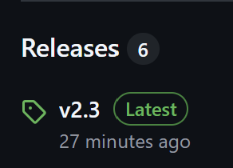
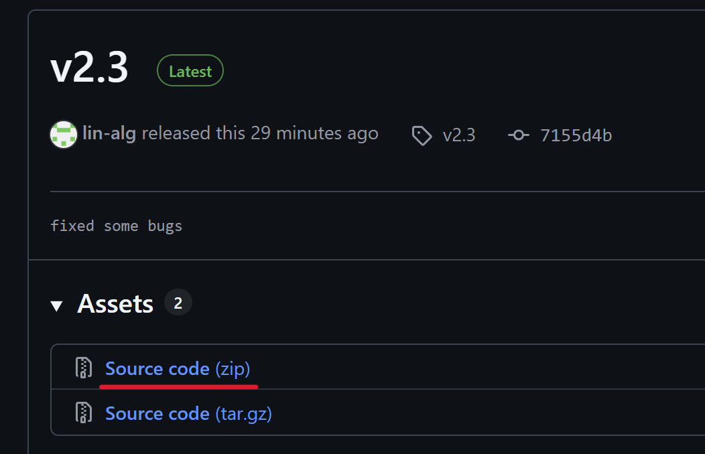
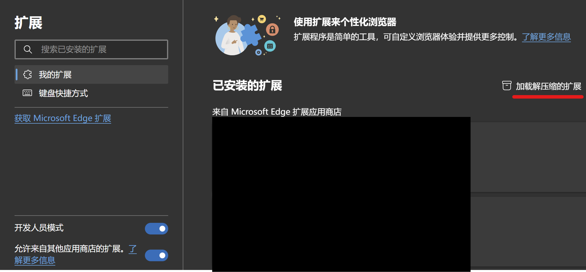
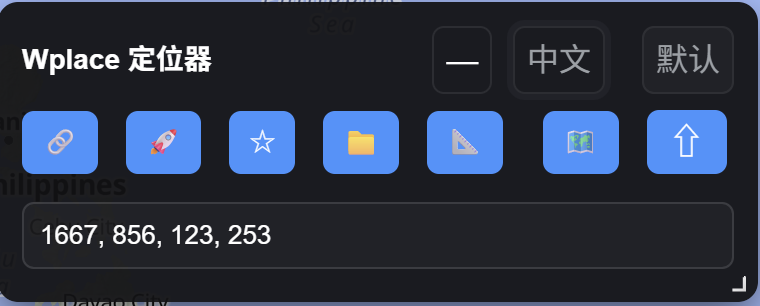
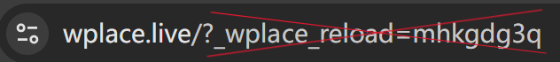

# Wplace_Versatile_Tool

(此浏览器扩展十分实用，值得您安装它的独立插件版本。如果您无法使用电脑端的Chrome内核浏览器（谷歌/Edge等），我提供了一个只包含坐标跳转功能的篡改猴版本：[安装链接](https://github.com/lin-alg/Wplace_Versatile_Tool/raw/refs/heads/main/Wplace_Locator.user.js) 。如果您愿意贡献完整的篡改猴版本，我将万分感谢)

## 支持本项目

觉得此插件不错，想支持本项目？[查看赞助方式](Sponsor.md) 或点击仓库右上角的 **Sponsor** 按钮。

(This browser extension is very useful and worth installing as a standalone plugin. If you cannot use a Chrome-based browser on your computer (Google Chrome/Edge, etc.), I have provided a Tampermonkey version with only coordinate navigation functionality: [Installation Link](https://github.com/lin-alg/Wplace_Versatile_Tool/raw/refs/heads/main/Wplace_Locator.user.js). I would be extremely grateful if you could contribute a complete version.)

选择语言 / Choose language  
- [中文（简体）](#a-中文部分)  
- [English](#b-english-section)

---

## A. 中文部分

### 目录（点击跳转）
- [概览](#概览)
- [适合谁用](#适合谁用)
- [快速开始](#快速开始)
  - [安装](#安装)
  - [快速使用步骤](#快速使用步骤)
- [常见问题（FAQ）](#常见问题faq)
- [隐私与安全](#隐私与安全)
- [反馈与支持](#反馈与支持)
- [常见问题](#常见问题)

---

### 概览
Wplace多功能工具 是一个轻量的悬浮式扩展。它可以：
- 分享坐标：一键分享基准坐标和位置信息
- 跳转：粘贴别人分享的坐标，立刻跳转到对应位置并自动向绘画插件填入基准坐标
- 收藏历史坐标
- 标尺：测量一幅画的总像素量或是长宽，不用再人工估计
- 快照：可以拍下任意选区的当前状态，并把它作为之后维护时的模板
- 修复了blue marble无法记住上次选择颜色的bug
- 地图样式：可以关闭地名和道路显示，使地图更清爽
- 快捷键：用键盘就可以放缩地图大小；新增可以显示/隐藏绘图插件的快捷键，绘图时更专心
- 自动检查更新功能
---

### 适合谁用
- 想快速在 wplace.live 上定位某个地方的用户；  
- 与朋友协作共享地图视角时需要精确坐标的场景；  
- 不想手动寻找并输入基准坐标的用户；
- 想提高绘画生产力的用户。

---

### 快速开始

#### 安装
1. 下载最新的release到本地。（以v2.3版本为例）

2. 打开 Chrome或Edge 扩展管理页（chrome://extensions/ 或 edge://extensions/），打开“开发者模式”。  
- 谷歌：

- Edge: 

3. 点击“加载已解压的扩展”，选择本项目的 src 文件夹。 
 
4. 打开或刷新 Wplace 网站。

#### 使用步骤
1. 页面右下角会出现一个悬浮图标，单击即可打开面板。 
 
2. 页面上有各种功能的按钮，鼠标移动到上面即可显示对应功能。
 
3. W键控制绘画插件（blue marble或者是skirk marble）的显示，S键控制本插件面板的显示，A和D分别是放大和缩小。长按鼠标右键可以缩小。    
在地图视野过宽的情况下，点击地图任意位置即可自动放大到那个区域，再也不会出现“请放大以选择像素”的烦人弹窗。
 
---

### 隐私与安全
- 本扩展仅在本地读取/写入需要的坐标与主题设置，不会把坐标上传到外部服务器。  
- 如果关心隐私或想查看实现，请检查扩展源码

---

### 反馈与支持
欢迎在仓库提交 Issue 或 PR，描述你遇到的问题并附上控制台日志（若方便）。页面适配问题通常需要目标页面的简要说明或截图帮助定位问题。

---

### 常见问题
- 如果无法切换主题或地图样式，请把后面的参数（?_wplace_reload=……）去掉，重新进入网站即可生效。
 
推荐移除道路显示，地名显示根据个人喜好决定。一旦选定好地图样式和主题，最好不要频繁切换，以免切换失败。

---

## A. English section

### Contents (click to jump)
- [Overview](#overview)
- [Who it's for](#who-its-for)
- [Quick start](#quick-start)
  - [Installation](#installation)
  - [Quick usage steps](#quick-usage-steps)
- [Privacy & security](#privacy--security)
- [Feedback & support](#feedback--support)
- [FAQ](#faq)

---

### Overview
Wplace Versatile Tool is a lightweight floating extension. It can:
- Share coordinates: one-click share of base coordinates and location info  
- Jump: paste coordinates someone shared to immediately jump to that position and automatically fill the base coordinates into the drawing plugin  
- Favorites of coordinates  
- Ruler: measure total pixels or width/height of an artwork so you no longer need to estimate manually
- Snapshot: take a snapshot of the selected area, then you can use the snapshot as a template.
- fix the bug that "blue marble" can not remember the colors you selected last time.
- Map styles: hide place names and roads to make the map cleaner  
- Hotkeys: zoom the map with the keyboard; new shortcut to show/hide the drawing plugin so you can focus while drawing  
- Automatic update checks

---

### Who it's for
- Users who want to improve Wplace drawing productivity.

---

### Quick start

#### Installation
1. Download the latest release and unzip it (v2.3 used here as an example).  
  
  
2. Open the Chrome or Edge extensions page (chrome://extensions/ or edge://extensions/) and enable "Developer mode".  
- Chrome:  
  
- Edge:  
  
3. Click "Load unpacked" and select this project's src folder.  
  
4. Open or refresh the Wplace website.

#### Quick usage steps
1. A floating icon will appear at the bottom-right corner of the page; click it to open the panel.  
  
2. Hover over the buttons in the panel to see their functions.  
  
3. Press W to hide the drawing plugin (blue marble or skirk marble), S to hide this extension panel, A and D to zoom in and out. Long press the right mouse button to zoom out.  
When the map view is too wide, click on the area you want to zoom in on and you won't see the annoying "please zoom in to select pixels" prompt.  
 

---

### Privacy & security
- The extension only reads/writes the required coordinates and theme settings locally and does not upload coordinates to external servers.  
- If you care about privacy or want to inspect the implementation, please review the extension source.

---

### Feedback & support
Open an Issue or PR in the repository, describe the problem and include console logs if possible. Page adaptation issues usually require a brief description or screenshot of the target page to help diagnose.

---

### FAQ
- If theme or map style changes do not take effect, remove trailing parameters like `?_wplace_reload=...` from the URL in the address bar and re-enter the site.  
  
We recommend hiding roads; place names are optional based on your preference. Once you settle on a map style and theme, avoid switching frequently to reduce the chance of failures.
---